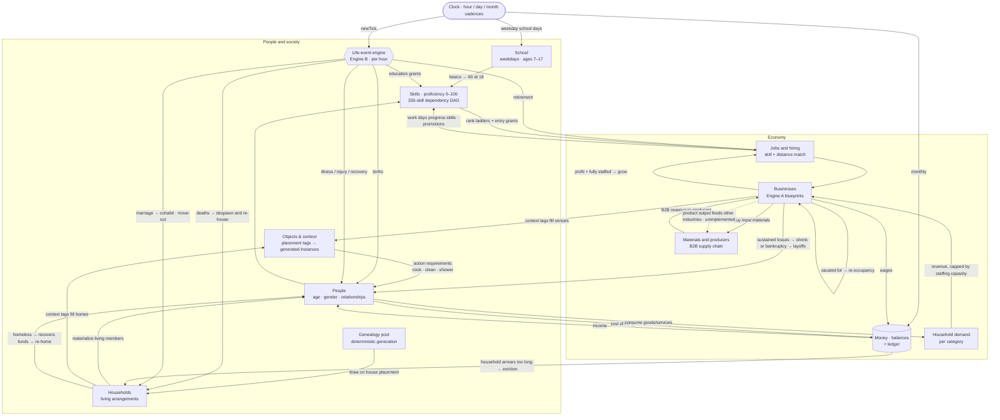

# TownBox

A 2D, top-down **city-builder prototype** built on **Phaser 4** + **React 18** in **TypeScript** — but the
city is only the stage. TownBox is really a **high-fidelity simulation of individual lives**: a deterministic
genealogy of thousands of people who are born, form families, learn skills, get jobs, earn and spend money,
fall ill, marry, move out, go broke, lose their homes, recover — and whose intertwined stories you can inspect
one person at a time.


> This is a personal project being refactored from a pile of isolated experiments into a real game with a real
> simulation loop. The design philosophy, current state, and working agreements live in
> [`CLAUDE.md`](CLAUDE.md); the granular backlog lives in [`docs/tasks/`](docs/tasks/README.md).

---

## Table of contents

- [What makes it interesting](#what-makes-it-interesting)
- [Architecture](#architecture)
- [The simulation loop](#the-simulation-loop)
- [Simulated systems in detail](#simulated-systems-in-detail)
- [Determinism & save/load](#determinism--saveload)
- [Tech stack](#tech-stack)
- [Getting started](#getting-started)
- [Project layout](#project-layout)
- [Status & roadmap](#status--roadmap)

---

## What makes it interesting

TownBox is **not** a "grow the biggest metropolis" game like SimCity or Cities: Skylines. The unit of interest
is the **person**, not the skyline. Everything below is a mechanism for producing rich, believable individual
life stories, then surfacing them.

- **A real genealogy.** A new world generates a deterministic pool of **thousands** of `GenPerson` records
  spanning many generations — mostly deceased ancestors plus a living cohort — carrying parents, partnerships,
  and birth/death ticks. Family trees span households because everyone shares one bloodline graph.
- **Households as living arrangements.** Placing a house draws a *coherent* household from the pool — a nuclear
  family, a single occupant, adult siblings, a multigenerational home, a minor living with a guardian because
  their parents died, or unrelated roommates — and materializes its living members onto the map.
- **A data-driven life-event engine.** Death, marriage, divorce, pregnancy & birth, illness/injury/recovery,
  education that grants real skills, retirement, friendships and arguments — all defined as **flat JSON** with
  eligibility predicates and probability gradients. A load-time compiler derives their dependency/exclusivity
  graph (NPM-style); mutual exclusivity is *derived, never authored*.
- **A generative business economy.** Work buildings spawn businesses from **blueprints** (≈39 lines of work
  across 9 demand categories — from supermarkets and hospitals to bars, libraries, parks and cemeteries), each
  with job positions that scale with size via declarative curves. Households generate demand; businesses compete
  for it by capacity; revenue, wages, cost of living, and P&L are all simulated, with the total money supply
  **conserved** against an external sector so a long run can't silently inflate or deflate.
- **An emergent bad-numbers cascade.** Oversupply → business losses → **shrink-via-layoffs** or **bankruptcy** →
  layoffs → unemployment → household **arrears** → **eviction → homelessness** → recovery through re-employment.
  Vacated shops and homes heal over time (re-occupancy, move-out). Nobody scripted these outcomes; they fall out
  of the numbers.
- **Inspect any life.** A universal Select tool opens inspectors for a person (identity, age, job, skills,
  relationships, and a dated **life-event log**), a business (positions, employees, balance, P&L), or a
  household (an interactive family tree). A city dashboard and a live event feed narrate the emergent story.

---

## Architecture

Three cleanly separated layers, plus persistence. The hard rule: **the simulation core never imports React, and
the GUI never reaches into simulation internals** — they communicate *only* through a custom event bus.

```
┌───────────────────────────────────────────────────────────────────────┐
│  React HUD  (src/app/hud/)                                             │
│  windows · inspectors · toolbar · clock · city feed · overview        │
└───────────────▲───────────────────────────────────────────┬──────────┘
                │  events (PersonSelected, cityEvent, …)     │  emits (saveGameRequest, toolSelected, …)
┌───────────────┴───────────────────────────────────────────▼──────────┐
│  GameManager  (event bus + orchestrator + coordinate math)            │
│  on / off / emit / emitSingle  ·  owns the Clock                      │
└───────────────▲───────────────────────────────────────────┬──────────┘
                │                                             │
┌───────────────┴─────────────────────────┐   ┌──────────────▼──────────┐
│  Simulation core  (src/app/game/)        │   │  Phaser scene            │
│  Field · Population · City · EventEngine  │   │  MainScene: input,       │
│  BusinessGen · Economy · Clock · markets  │   │  camera, grid, rendering │
└───────────────────────────────────────────┘   └─────────────────────────┘
                │
        ┌───────▼────────┐
        │  Save / load    │  id-based WorldSnapshot → deflate (pako) → base64 → pluggable provider
        └────────────────┘
```

- **Simulation core (`src/app/game/`)** — pure(ish) TypeScript, unit-testable without a live scene: the tile
  `Field`, the genealogy `Population`, the `City` orchestrator, the life-event `EventEngine` + `EventCompiler`,
  business generation (`BusinessGen`), the `Economy` ledger, the `Clock`, and the adapter "markets"
  (`JobMarket`, `HousingMarket`, `SkillRegistry`) that let the scene-free engine touch the materialized world.
- **Event bus (`GameManager`)** — a small custom emitter (**not** Phaser's): `on`/`off`/`emit` (async fan-out)
  and `emitSingle` (one handler, returns a value). Every cross-system signal and its payload type is declared in
  `types/Events.ts` first, then wired. This is the single seam between simulation and UI.
- **React HUD (`src/app/hud/`)** — a windowing system (drag/resize via `react-rnd`), the toolbar, a persistent
  clock and city event feed, and the inspector/dashboard windows. It talks to the game **only** through the bus.
- **Save/load** — the entire world (tiles, the genealogy pool, households, people & relationships, vehicles,
  businesses, money, event history) serializes to an **id-based** snapshot, deflated and base64-encoded, behind
  a pluggable `SaveProvider` (localStorage today). The id-based model lets the cyclic relationship/ownership
  graph survive a JSON round-trip.

---

## The simulation loop

Time comes from one `Clock` (**1 in-game day = 1 real hour**, on a 30-day-month / 360-day-year calendar). The
canonical simulation tick is the **in-game hour** (24 ticks/day); the clock emits `timeChanged` (per minute),
`newTick` (per hour), and `newDay` (per rollover). Three cadences ride on top:

- **Per hour (tick)** — the life-event engine (Engine B) resolves detailed events over every materialized
  person through a shared tick lifecycle that live play and the history bootstrap both run, behind a formal
  live/bootstrap **execution boundary**; every commit lands in an append-only per-person log with sequence
  numbers and causation ids.
- **Per minute** — the commute scheduler moves employees between home and work.
- **Per month** — the economic tick runs payroll → demand-driven business P&L → producer (B2B) revenue →
  growth / shrink-via-layoffs / bankruptcy → vacant-lot re-occupancy → household cost-of-living → eviction →
  homeless recovery.

Everything feeds back into everything. The diagram below ties the simulated aspects — **people, skills, jobs,
businesses, materials, money, life events** — into one loop:



**Reading the loop.** A household is drawn from the pool and its living members become `People` on the map, each
with a deterministic set of `Skills`. The **life-event engine** runs every in-game hour, aging the world forward: it
marries people (who then move in together), grows families (births), ends lives (deaths, which trigger orphan
re-housing), grants skills through education, and toggles health via illness/injury/recovery. Children attend **school**
on weekdays, landing every basic skill at exactly 60 by 18 (perfect attendance); **proficiency** (0–100, on a
335-skill dependency DAG) gates hiring — jobs carry full **rank ladders** with entry training grants, and
completed work days progress skills until a deterministic **promotion**. Placement **tags** on homes and
businesses generate real **object instances**, and what people can *do* somewhere (cook, clean, shower, grab,
lend) follows from what's there. Skills make a person **hireable**; the **job market** matches them to open positions at **businesses** (generated from
blueprints, their job counts scaling with size). Businesses pay **wages** into the money ledger; people spend on
**cost of living** and generate per-category **demand**; businesses compete for that demand by staffing capacity,
earning **revenue** and buying **input materials** — which become **B2B demand** on local producers (farms,
factories, warehouses) who earn by supplying it. The monthly **P&L** decides fates: profitable, fully-staffed
businesses **grow**; a solvent business that stays unprofitable **shrinks** — shedding a size step and laying off
its surplus back into the job market; and a business that sinks below the debt floor for too long goes
**bankrupt**, lays everyone off, and leaves a vacant lot that later attracts a *different* business. On the
household side, too many months of unpaid **cost of living** ends in **eviction** and **homelessness**, escapable
when someone finds work again and the family can afford a vacant home (or move in with relatives if the town is
full). The one dotted edge — a business's **product output** feeding *downstream industries* as more than
just raw materials — is **not yet implemented** (see [task 035](docs/tasks/035-materials-and-products_DONE.md)
for the materials/B2B layer that exists, and the roadmap for where it goes next).

---

## Simulated systems in detail

### Population & genealogy
A pure `generatePopulation(seed, params)` forward-simulates founders → generations of intertwined families →
lifespans, producing a flat, serializable table of people (deceased ancestors + a living cohort). **Kinship and
age are never stored** — siblings, grandparents, cousins, and current age are derived on demand from the graph
and the live clock, so people genuinely get older as time passes. A coarse yearly off-map sim advances mortality
and fertility for people who aren't on the map.

### Life events (Engine B)
`json/events.json` is a flat manifest: each event declares its **roles** (a subject plus co-participants bound by
relation or found by a candidate search), a per-year **probability** with `Curve` factors (e.g. mortality rises
with age; a `health` attribute raises death probability), and a closed, typed **effects** vocabulary
(`setDeath`, `marry`, `birth`, `setAttr`, `acquireSlot`, `acquireSkill`, `adjustMoney`, `emit`, …). A compiler
derives the dependency/exclusivity graph; the runtime resolves it per hour over materialized people, records a
per-person history, and queues signals the `City` turns into world changes (re-housing, cohabitation, move-out)
and feed entries. Adding an event is **pure data**; adding a new attribute or effect primitive is a deliberate,
tested code change.

### Skills, jobs & businesses (Engine A)
Skills (335 — 15 basics + 320 specific abilities on a dependency DAG, each held as a 0–100 **proficiency** with
provenance) and jobs (≈33, each with a full authored **rank ladder** and an explicit entry training grant) are
JSON reference tables kept internally consistent by validators — including the CI-enforced reachability rule (a
fresh 18-year-old with school basics can reach every job's entry rank), the self-climbing rule (no ladder
silently stalls), and the consumption rule (every non-basic skill is required or progressed by some job rank, so
none is inert data). Business
**blueprints** (≈39, across groceries, dining, healthcare, education, construction, retail, leisure, services,
hospitality, plus civic/leisure venues and B2B producers) describe how to generate a business of a given size: each job's position count
is a `Curve` over size, so a big supermarket has proportionally more clerks than janitors. Hiring is a real
event (`get_job`) resolved through a **`JobMarket`** adapter that scores candidates by skill fit minus
home↔work distance and hires into the highest rank strictly met (else the entry rank via its grant) — so school,
education and work experience genuinely unlock better jobs and promotions.

### Money & the economy
A serializable `Economy` holds per-person and per-business balances behind one ledger primitive (`transfer`). A
monthly tick runs **wages** (businesses → employees), **cost of living** (households → suppliers, accruing
`arrears` when they can't pay), and **demand-driven P&L**: `revenue = unitsSold × price` (units capped by
`staffing × throughput` and split among competitors by capacity), minus materials, fixed costs, and payroll.
Sustained profit + full staffing → **growth**; sustained losses while still solvent → **shrink-via-layoffs**
(a size step shed, surplus staff back on the market); a balance below the debt floor for too long → **bankruptcy
& closure** (staff laid off, lot vacated, debt written off), after which a cooldown lets a new business move in.
Every one-sided flow (revenue, cost of living, materials, starting capital, write-offs) is balanced against an
**external sector** account, so the grand total (people + businesses + external) is **conserved** — a long run
neither mints nor burns money.

### Materials & the B2B supply chain
A business's input **materials** become demand on local **producers** whose `products` are those materials —
farms produce food, factories produce building/hardware/electronics stock, warehouses produce retail/office
goods (and medical/school supplies and auto parts). The same demand-resolution machinery runs a second time
keyed by material, so producers earn B2B revenue by supplying downstream shops; a validator guarantees every
consumed material is produced by some blueprint. (Deeper multi-tier product chains and business product *output*
beyond raw materials are future work.)

### Household lifecycle dynamics
Households aren't frozen at placement. Death re-houses orphaned minors with a living relative; marriage triggers
**cohabitation** (newlyweds move in together); grown, employed adults **move out** into a vacant home to start
their own household; insolvency drives **eviction → homelessness**, with recovery once funds return — into a
vacant home, or, if the town is full, in with a relative or as roommates in any home with a spare room. All of it
runs through one shared relocation helper.

### Movement & commute
A shared A\* pathfinder routes people over sidewalks/crosswalks and cars in their lanes. Employed residents run a
daily **commute** state machine: exit home → walk to car → drive → walk to work → enter, and back at shift end.

---

## Determinism & save/load

Determinism is a first-class constraint: the population pool, household draws, skill assignment, business
generation, and every day of the event engine are **seeded** from the world seed, so the same world reproduces
identically and survives a save/load round-trip. Saves are a versioned, id-based `WorldSnapshot` (migrations
carry old saves forward), deflated with `pako` and base64-encoded behind a pluggable `SaveProvider`.

---

## Tech stack

| Concern     | Choice |
| ----------- | ------ |
| Engine      | Phaser `^4.1` |
| UI          | React `^18` + `react-dom`, windows via `react-rnd` |
| Language    | TypeScript `^5.4` (strict) |
| Bundler     | Parcel `^2.12` |
| Tests       | Jest `^30` + `ts-jest` (unit); Playwright integration is planned |
| Data viz    | D3 `^7` (family-tree graph) |
| Fake data   | `@faker-js/faker` (`pt_BR` locale) |
| CI          | GitHub Actions — typecheck, coverage-gated unit suite, production build |

---

## Getting started

```bash
npm install
npm run dev          # copy images, Parcel watch, and serve with browser-sync
```

Other scripts:

```bash
npm test               # fast unit suite (Jest + ts-jest)
npm run test:coverage  # unit suite with the coverage-threshold gate (game/ + util/)
npm run typecheck      # strict tsc --noEmit
npm run build-prod     # production Parcel build
```

CI (`.github/workflows/ci.yml`) runs the type check, the coverage-gated unit suite, and the production build on
every PR to `main` and every push to `main`.

---

## Project layout

```
src/
  app/
    main.tsx            # React entry; boots GameManager, mounts <HUD>
    game/               # simulation core (no React): Field, Population, City, EventEngine,
                        # BusinessGen, Economy, Clock, PathFinder, markets, save/
    hud/                # React GUI: window manager, toolbar, clock, feed, inspector windows
  json/                # tunable data: events, businesses, jobs, skills, demand, economy, …
  types/               # shared TypeScript types (Events, Genealogy, Business, LifeEvent, Save, …)
  util/                # curves, predicates, kinship, random, time, compression, …
test/                  # Jest unit/integration suites
docs/tasks/            # the JIRA-style backlog (each file is a self-contained, mergeable task)
```

For a much deeper, source-verified walkthrough of every subsystem, read [`CLAUDE.md`](CLAUDE.md).

---

## Status & roadmap

The **014–037** arc is complete: employment & movement, the full economy cascade (wages → cost of living →
business P&L → bankruptcy → eviction/homelessness → recovery, with a B2B supply chain), household-lifecycle
dynamics, the UI/inspector layer, content expansion, CI, and a per-load history bootstrap that gives freshly
drawn people real event histories.

The **039–054 simulation-enrichment arc** is complete (architecture in
[task 038](docs/tasks/038-simulation-enrichment-architecture_DONE.md)): hourly ticks (24/day), object archetypes
& per-person **Possessions**, the data-driven **Action** system, event **triggers** with causation-chained logs,
the per-person **Brain**, job shifts & the **Job Orchestrator** — all behind the live/bootstrap **execution
boundary**. So is the **056–075 progression & context arc**: the weekday/weekend calendar, **school** (ages
7–17, weekdays), **skill proficiency** (0–100 on a 335-skill dependency DAG, school basics landing at exactly
60 by 18), **job rank ladders** with entry training grants and deterministic **promotions**, **placement tags**
and deterministic **building object generation**, context-grounded action requirements, and person-targeted
interaction **contracts** with a deterministic **consent** flow and typed action failure — validated end-to-end
(live ↔ bootstrap equivalence, tick-budget re-pins) by task 075.

A post-arc **audit-remediation pass (076)** then closed the consumption gaps the arcs left behind: contextual
objects generate **at placement** (not only on save/load); **all authored content is now consumed** — orphaned
skills wired into job progression, the deferred venues promoted to real blueprints so every object can spawn, the
generic object verbs proposed by the inventory hook, and computable milestone events (born, became-parent,
widowed, homeless, moved-out…) fired from the transitions the sim already performs — each guarded by a CI
reachability test; businesses **shrink-via-layoffs** as well as grow; and **money is conserved** via an explicit
external sector.

**In flight / planned** (see [`docs/tasks/`](docs/tasks/README.md)):

- **055 — offline history-asset pipeline** (renumbered from 038). **Pipeline landed:** the deep sim runs
  *once, offline* (`npm run generate-history` — 100 founders → grow to 1,000 → simulate 500 years, with an
  incremental living index and a soft carrying capacity) into a **versioned, compressed asset**, and new games
  *select* a random window from it (rebased to tick 0, identities re-randomized) instead of simulating — the
  per-load history bootstrap is retired.
- **077 — offline logical-economy world** (055 follow-up, landed). The generator can run an **off-map logical
  world** (homes, schools, jobs, object generation) during generation, so the asset carries **lived skills,
  real careers-as-history, and possessions** — not just pool-intrinsic demographics. Skills are a **per-person
  timeline**, so new-game selection installs each drawn person's proficiency *as of the chosen window*.
  Generation **streams to sharded files** (RAM-bounded) and the asset is a **directory** of chunks the game
  loads on demand (only the shards up to the window), so large assets stay git-friendly without LFS.
  Population is kept **stable, not exponential**: each person has an innate **max children** they'll have, and
  the offline generator runs a **thermostat** (hysteresis pivots) on a global fertility multiplier to hold a
  target headcount.
- **008** — Playwright integration suite (browser-level tests).
- **033c** — optional tier-2 demand (locality/catchment, price elasticity).
- Business **product output** into downstream industries (beyond raw materials).

---

*Not affiliated with any commercial product; a personal simulation-first experiment.*
