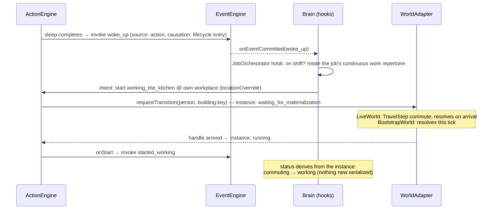
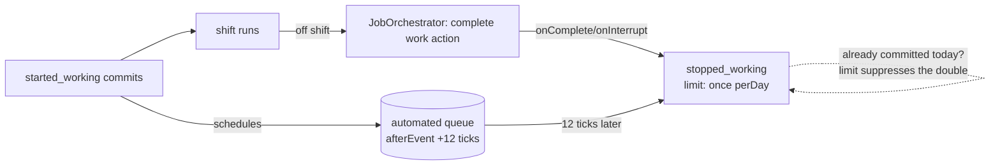
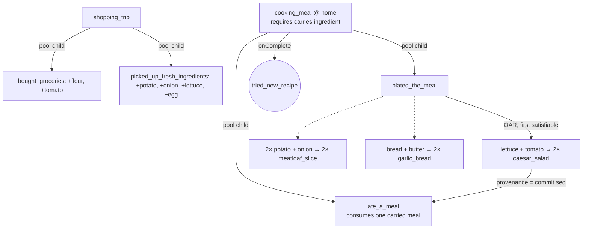
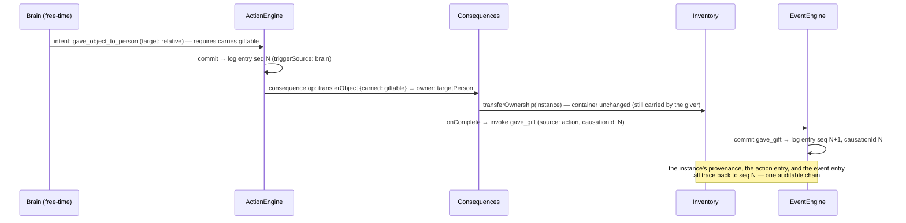

# Simulation flows: how Actions, Events, Objects and the Brain interlock

The enrichment arc (tasks 038–053) made Actions and Events deliberately coupled *at the data level*:
actions fire events on lifecycle transitions, events are invokable by actions and systems, and object
transformations ride on action commits. This document walks the load-bearing flows through real,
shipped data so a contributor can hold the whole loop in their head. The mechanical, always-current
relationship tables are generated from the manifests into
[simulation-relationships.md](simulation-relationships.md) (`npm run docs:sim`; a checked-diff test
keeps it honest).

Cast of components (all under `src/app/game/`): `TickRunner` (the shared 9-phase per-tick lifecycle,
both execution modes), `Brain` (stateless decisions → intents), `JobOrchestrator` (the job-context
Brain hook), `ActionEngine` (discrete commits + continuous instances), `EventEngine` (rolls, invokes,
schedules), `Consequences` (the bounded mutation DSL + OAR executor), `Inventory` (object instances),
and the **execution boundary** (`WorldAdapter`: `LiveWorld` resolves transitions via real commutes,
`BootstrapWorld` immediately — same records either way, never an `if bootstrap`).

## 1. Waking up → obligation → commute → work

The daily anchor. `sleep` completing fires `woke_up`; the Brain reacts to the commit, the Job
Orchestrator starts the shift's work action at the person's own workplace, and the action's location
requirement is what actually causes the commute — "Started working" is logged on *arrival*, never at
departure.

## 2. Shift end → completion, and the automated fallback

Off shift, the orchestrator requests completion: employer-owned work outputs are already in the
business inventory, and `stopped_working` commits. If nothing does it (a stuck lifecycle, an edge the
orchestrator missed), the event's own **automated schedule rule** — `afterEvent started_working
+12 ticks` with a `once: perDay` limit — sweeps the same event through the persisted queue, so a
workday always closes exactly once, whichever path fires first (048).

## 3. Cook-and-eat: object transformations on action commits (044/053)

Continuous actions orchestrate discrete children; each discrete commit applies the FIRST satisfiable
object-action-relationship entry against the person's carried instances — two-phase atomic, so a
missing ingredient is a typed `inputsUnavailable` with zero mutations. Ingredients come from the
shopping actions, so the whole chain is reachable in normal play.

The bake-a-cake reference chain (044) is the same shape with a **sequence** instead of a pool:
`mix_dough` (flour+eggs → `raw_dough`, bound as `$previous.output`) → `bake_dough` (transformed in
place, oven required at the location) → `add_topping` (+cream → one `cake`, identity preserved).

## 4. A gift, end to end: the causation chain

Social object transfer with every link recorded. Ownership and containment are independent axes
(041), and each arrow below lands in the ONE append-only per-person log with a `causationId` pointing
at what caused it — the inspector renders the chain directly.

## Where the boundaries are

- **Pure data:** new events, actions, OAR entries, archetypes, job repertoires — files only, gated by
  the schema registry (039) and the reachability/statistical tests.
- **Code changes:** new effect kinds, Context attributes, consequence ops, predicate node types,
  Brain hooks. Deliberate and rare (038's flexibility line).
- **Execution boundary:** anything that needs physical presence requests a transition through the
  `WorldAdapter` and waits (`waiting_for_materialization`); only the *wait* differs between live and
  bootstrap. If you find yourself writing `if (mode === 'bootstrap')`, stop — that's the line the
  whole arc exists to hold.
